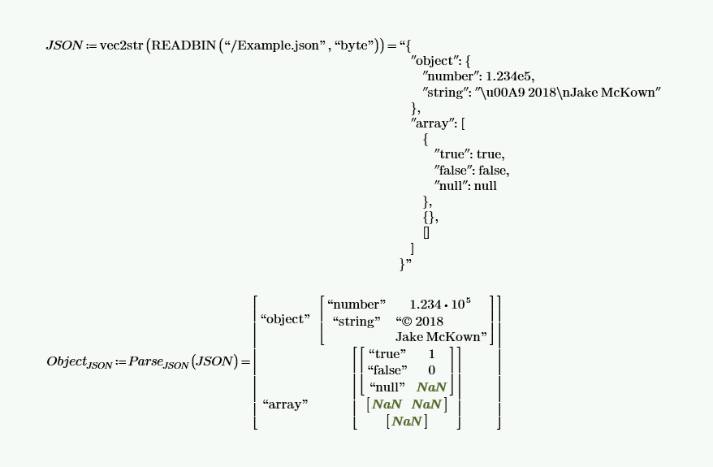

# JSON support for PTC Mathcad Prime

Inspired by, and in some parts ported directly from VBA to Mathcad from, [Tim Hall](https://github.com/timhall)'s [VBA-JSON](https://github.com/VBA-tools/VBA-JSON).

## Examples

Read and parse JSON file:

Update JSON object:

## Installation

Install functions in the following order:
1. *Unicode*
2. *Concatenate*
3. *ParseErrorJSON*
4. *SkipSpacesJSON*
5. *ParseStringJSON*
6. *ParseKeyJSON*
7. *ParseNumberJSON*
8. *ParseLiteralJSON*
9. *ParsePrimitiveJSON*
10. *ParseValueJSON*
11. *ParseJSON*
12. *GetValueJSON*
13. *SetValueJSON*

Mathcad has its own programming language, but it's embedded in the Worksheet and not directly available as text. There are three methods for installation. 

### Method 1: Copy from the MCDX file

1. Download the MCDX file.
2. Copy the functions from JSON.mcdx.
3. Paste the functions into your own Worksheet.

### Method 2: Include the MCDX file

1. Download the MCDX file.
2. In Mathcad, include a Worksheet with CTRL+SHIFT+W.
3. Click on the *Include* button.
4. Browse for the MCDX file.

### Method 3: Copy from the TXT files

For each TXT file:
1. Copy the text from the TXT file.
2. In Mathcad, insert a Math Region with CTRL+SHIFT+M.
3. Paste the text into the Math Region. The function will be rendered as math instead of text.
